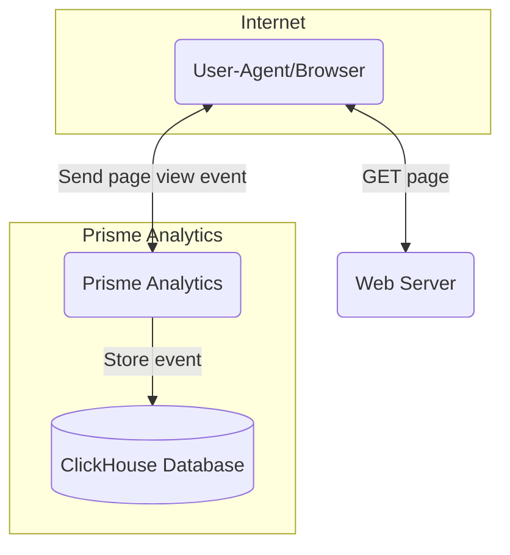

# Ingestion Mode

Ingestion mode is a light Prisme Analytics mode for handling and ingesting events.

It integrates solely with [ClickHouse](https://clickhouse.com). Databases tables,
Grafana datasources and dashboards are all prepared during server start up.

## Overview

## Configuration Options

Configuration of your instance is done by setting `PRISME_<option name>`
environment variable.

### Server Options

#### Access Log

Path to access log file.

Default: `PRISME_ACCESS_LOG=/dev/stdout`

#### Debug

Enable browsing of static file (HTTP server), sets application logger log level
to debug and serve static file from disk (instead of embedded from binary).

This options is mainly used for development purposes.

Default: `PRISME_DEBUG=false`

#### Server Port

Web server listening TCP port.

Default: `PRISME_PORT=80`

### Server Proxy Options

Prisme Analytics can be positioned behind a reverse proxy, and this section
provides information on options related to the proxy setup. It's important to
note that a misconfigured server can have security implications. Hence, Prisme
Analytics prioritizes **security by default** with carefully chosen default values.

#### Trust Proxy

Whether X-Forwarded-For, X-Request-Id and other proxy related headers should be
trusted. Sets this value to true only if your instance is running behind a proxy.

Default: `PRISME_TRUST_PROXY=false`

#### Proxy Header

HTTP header used to detemine client IP address when Prisme Analytics is placed
behind a trusted proxy.

Default: `PRISME_PROXY_HEADER=X-Forwarded-For`

### ClickHouse Options

#### Secure connection

Use a TLS connection for ClickHouse.

Default: `PRISME_CLICKHOUSE_TLS=false`

#### Host And Port

`<host>:<port>` string pointing to a ClickHouse instance.

Example: `PRISME_CLICKHOUSE_HOSTPORT=clickhouse.localhost:9000`  
This options is **mandatory**.

#### Database

ClickHouse database to use.

Default: `PRISME_CLICKHOUSE_DATABASE=prisme`

### Source Registry Options

#### Sources

Comma separated list (without whitespace) of valid sources/domains. Events coming
from an invalid source are rejected.

Example: `PRISME_SOURCE_REGISTRY_SOURCE=www.example.com,app.example.com`

### Event Store Options

Event store is an internal service responsible of storing events efficiently in
ClickHouse.

#### Maximum Batch Size

Maximum size of batch before sending it to ClickHouse.

Default: `PRISME_EVENTSTORE_MAX_BATCH_SIZE=4096`

#### Maximum Batch Timeout

Maximum duration before a batch `n-1` is sent to event store.

Default: `PRISME_EVENTSTORE_MAX_BATCH_TIMEOUT=1m`

