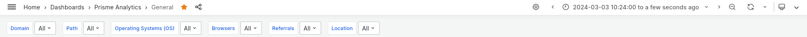
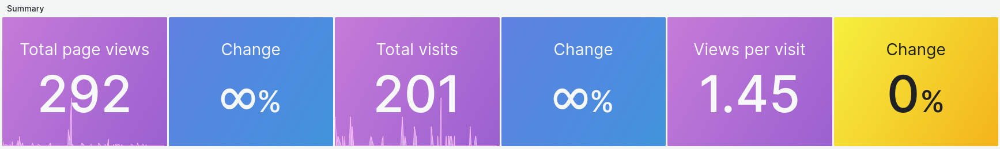
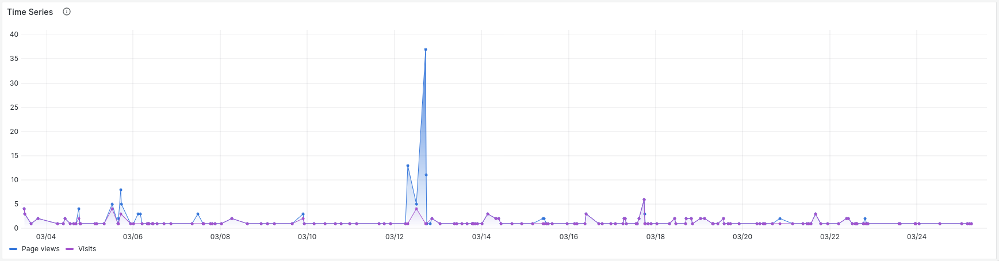
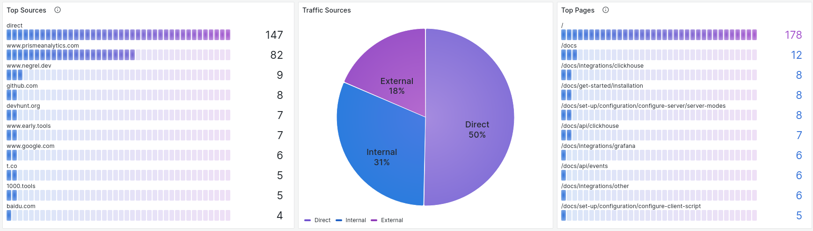
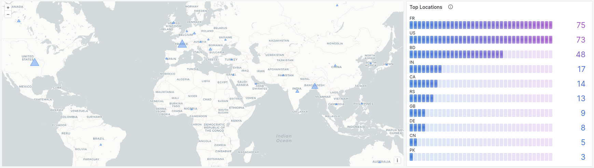
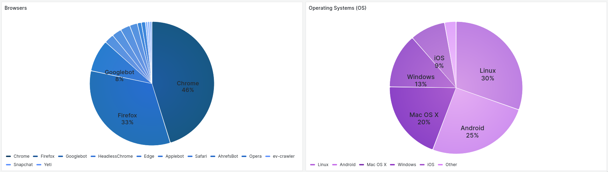

# General Dashboard Overview

Prisme comes with a built-in general dashboard to visualize your data in
different ways. It is very similar to other analytics dashboards as it is
unopiniated and uses common metrics.

This pages introduce and explains every panels of the dashboard.

Let's break down and analyse the dashboard into sections.

## Parameters

Parameters section influences how your analytics data are retrieved and displayed.

It enables you to filter traffic data and visualize only what you want/need. Here
is a screenshot of 7 parameters of general dashboard:

### Date Time Range

First parameter is date time range. It is built-in into [Grafana](https://grafana.com/grafana),
the software we're using to display our dashboard.

This parameter allows you to select the period you want to display (e.g. last
6 months, last 2 hours, etc). You can also select arbitrary date.

### Domain

Next parameter is the domains. Prisme takes a different approach than other analytics
services and let you visualize all of you websites data on a single dashboard.
This parameter let you filter which domains you want to see.

### Path

Path parameter filters pages path.

### Operating Systems (OS)

Operating Systems filter on visitors operating systems family.

### Browsers

Browsers filters on visitors browsers family.

### Referrals

Referrals filters on referral sources.

### Locations

Referrals filters on visitors locations (country).

## Summary

First section with panels summarizes you website traffic in numbers and percentage.

Change percentages are computed based previous period. If you selected time range
`Last 2 days - now`, changes are computed against `Last 4 days - Last 2 days`.

## Time serie

Second section contains a time serie graph with visits (purple) and page views
(blue) over time.

## Top Sources

Next section is about traffic sources. It contains three panels:

First panels shows a top 10 of referrals / sources of traffic.

Second panels is a pie chart showing percentage of direct, internal and external
traffic.

Third panel is a top 10 of most viewed pages.

## Location

Location sections shows visitors location. First panel is a map with marker size
relative to the number of page views per country. Second panel is a top 10 of
visitors' locations.

## Devices

Last section is about visitors' devices.

First pie chart shows visitors' browser family.

Second pie chart shows visitors' operating systems family.

