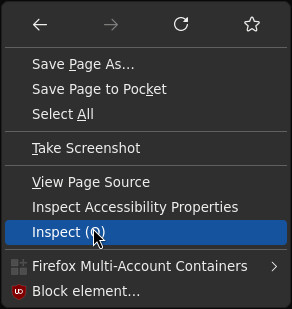
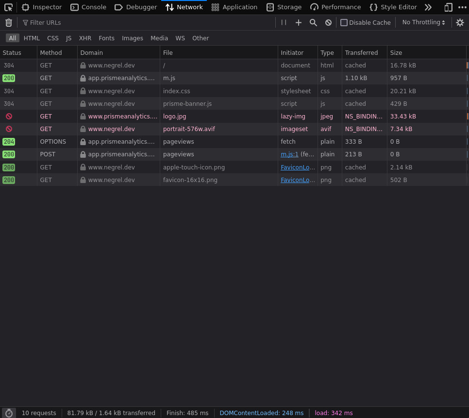

# How to setup tracking script

This guides shows you how to add Prisme Analytics tracking script to your
website.

Our tracking script is ultra light (< 1kB) and designed to not slow down your
website. You can consult its content
[here](https://github.com/prismelabs/analytics/blob/master/tracker).

## Prerequisites

- You have a [running Prisme Analytics instance](./self-host-prisme-docker.md).

## Step 1: Add script tag

In order to track pageviews and other metrics, you must add Prisme tracking
script on **all pages**.

Regardless of the technology used, all pages must contain the following tag
either in `<head>` or `<body>` tag.

```html
<script src="https://<your-prisme-instance-hostname>/static/wa.js" defer></script>
```

Depending on the tools you're using to build your website this can be as simple
as editing a single file.

:::note

Tracking script can be configured, see options
[here](../references/tracking-script.md#configuration-options)

:::

:::note

If you're serving tracking script using a CDN, be sure to set
[`prisme-url`](../references/tracking-script.md#prisme-url-data-prisme-url)
option

:::

## Step 2: Add noscript tag (optional)

If you website can works without javascript and you wants to track visitors with
javascript disabled, you can add the following snippet:

```html
<noscript>
    
</noscript>
```

For all `/api/v1/noscript/events/*` handlers, Prisme returns a small (35 bytes)
single transparent pixel GIF image.

You can read more about noscript events
[here](../references/http.md#noscript-events-api).

## Step 3: Test

Once you've added the script tag, check that tracking works by visiting a page
containing it.

Open your browser, navigate to the page and open developer tools (press right
click and then inspect).



Then go to the network tab:



And search for requests to
`https://<your-prisme-instance-hostname>/api/v1/events/pageviews`. You should
see a `POST` request with a `200 OK` response. On the above screenshot, Prisme
instance hostname is `app.prismeanalytics.com`.

If you received a non 200 response, it means an error occurred. In that case,
checkout relevant [troubleshoot](#troubleshoot) section.

## Step 4: Multiple domains (optional)

If your website is accessible via multiple domains/subdomains (e.g.
`example.com` and `www.example.com`) you **must** register all of them.

If you want to store them all under a single domain name, you can specify one
using `data-domain` attribute:

```html
<script src="https://<your-prisme-instance-hostname>/static/wa.js"
    data-domain="example.com"
    defer>
</script>
```

## Troubleshoot

### 400 Bad Request

If you received a `400 Bad Request`, it means that your Prisme instance rejected
the request because it came from an unauthorized
[origin](https://developer.mozilla.org/en-US/docs/Web/HTTP/Headers/Origin).

This can be fixed by adding your website domain to
[Prisme origins registry](../references/server/default-mode.md#origin-registry-options).

### Other

For any other errors, check Prisme logs using
`docker logs <prisme-container-name>`.
