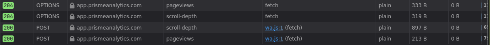
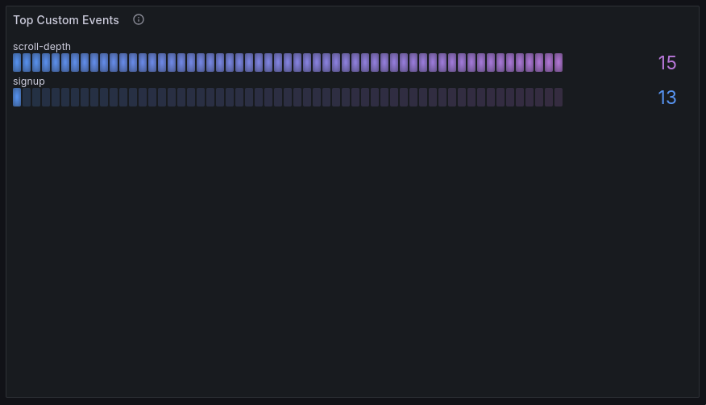
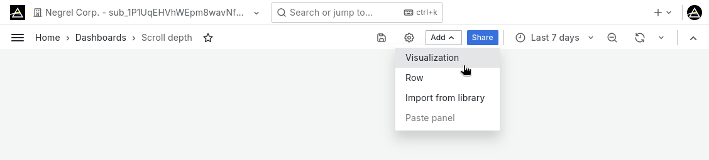
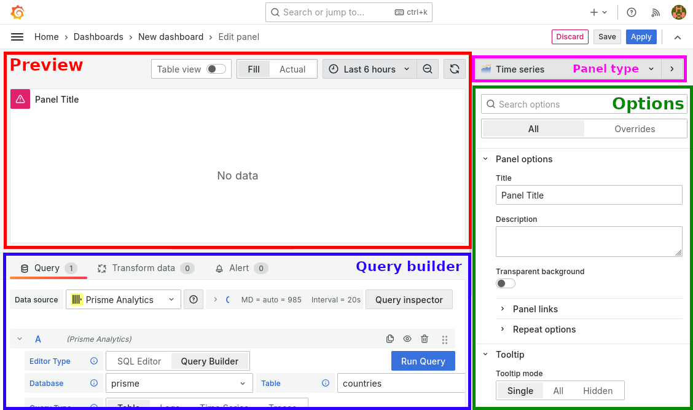
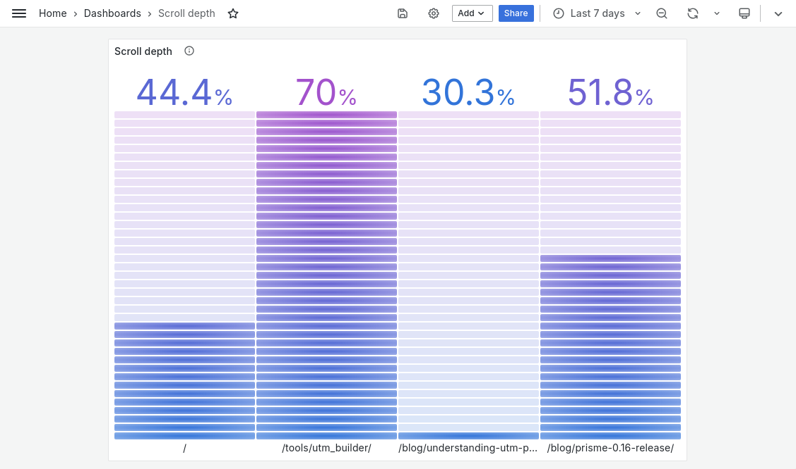

---
---

import SelectBarGaugePanelType from "./images/select_bar_gauge_panel_type.png"

# How to track scroll depth

Tracking scroll depth helps you identify which sections of your page are most
relevant to your users, allowing you to focus on the most important areas first.
This approach ensures that your efforts are targeted and effective, rather than
spreading yourself too thin across the entire page.

In this guide, we go over measuring scroll depth, calculating, tracking and
visualizing it with Prisme Analytics.

You can check the result on our
[live demo](https://app.prismeanalytics.com/grafana/d/eegq2vj9n7bb4c/web-analytics?orgId=5&kiosk=&from=now-7d&to=now&timezone=browser).

## Prerequisites

- You must have a website with
  [default Prisme Analytics tracking](../guides/setup-tracking-script.md)
  working.
- You must have created a [custom dashboard](./create-a-custom-dashboard.md)

## Step 1: Measuring scroll depth

In order to track how depth visitors scrolls we must measure it first. There are
multiple ways to so but for this guide we measure scroll percentage.

```js
const measureScrollDepth = () => {
  const scrollEl = document.scrollingElement;
  const scrollTopMax = scrollEl.scrollHeight - scrollEl.clientHeight;
  return Math.round((scrollEl.scrollTop / scrollTopMax) * 100);
};
```

This function will return `100` at the bottom of the page and `0` at the top.

## Step 2: Capturing scroll depth

Now that we can measure scroll depth, we must capture it each time user stop
scrolling.

Browsers expose two scroll related events:

- [`scroll`](https://developer.mozilla.org/en-US/docs/Web/API/Document/scroll_event)
  event fires when the document view has been scrolled
- [`scrollend`](https://developer.mozilla.org/en-US/docs/Web/API/Document/scrollend_event)
  event fires when the document view has completed scrolling

We'll use the latter as we don't care about intermediate scroll position.

```js
// Keep track of max scroll depth.
let maxDepthY = 0;

// Update variable each time user stop scrolling (or change scroll direction).
globalThis.addEventListener("scrollend", () => {
  maxDepthY = Math.max(maxDepthY, measureScrollDepth());
});
```

This code snippet updates `maxDepthY` variable to ensure we track up to date
value.

## Step 3: Detect navigation and exits

In order to send event to Prisme, we must detect when visitor leaves page or
close the tab/browser as it means it won't scroll deeper in the page.

Detecting navigation is pretty easy as browsers expose multiple events for it.
The recommended way is to listen for `pagehide` events that are sent to a
[`Window`](https://developer.mozilla.org/en-US/docs/Web/API/Window) when the
browser hides the current page in the process of presenting a different page
from the session's history.

If your website is a Single Page Application (SPA) with a client side router,
then you also wants to detect when router load a new route. Client side routers
make use of the
[`History`](https://developer.mozilla.org/en-US/docs/Web/API/History) API and
specifically the
[`pushState`](https://developer.mozilla.org/en-US/docs/Web/API/History/pushState)
function. Unfortunately, there is no `pushstate` event so we have to hook into
`History.pushState()` function manually.

```js
const sendScrollDepthEvent = () => {/* STEP 4 */};

// User navigate to other page / website.
globalThis.addEventListener("pagehide", sendMaxScrollEvent, { capture: true });

// Single Page Applications use history API for navigation.
if (globalThis.history) {
  // There is no pushstate event so we replace pushState with our function
  // that forward calls to the original function.
  const pushState = globalThis.history.pushState;
  globalThis.history.pushState = function () {
    pushState.apply(globalThis.history, arguments);
    sendScrollDepthEvent();
  };
}
```

This handles navigation but we still have to handle the closing tab/browser
case. Currently, there is **no reliable** way to detect this across browsers and
device (especially mobile devices).
[MDN](https://developer.mozilla.org/en-US/docs/Web/API/Document/visibilitychange_event#sending_end-of-session_analytics_on_transitioning_to_hidden)
recommends listening on
[`visibilitychange`](https://developer.mozilla.org/en-US/docs/Web/API/Document/visibilitychange_event)
for end-of-session analytics even though
[user is still on website and may have
just switched to another tab](https://developer.mozilla.org/en-US/docs/Web/API/Document/visibilitychange_event#usage_notes).

```js
globalThis.addEventListener("visibilitychange", () => {
  if (document.hidden) sendScrollDepthEvent();
});
```

If that don't fit your needs and truly wants to track when user closes tab /
browser, you can still use the
[non recommended](https://developer.mozilla.org/en-US/docs/Web/API/Window/beforeunload_event#usage_notes)
[`beforeunload`](https://developer.mozilla.org/en-US/docs/Web/API/Window/beforeunload_event)
event that works well on Chrome, Firefox and (maybe) Safari on desktop.

## Step 4: Send `scroll-depth` Event

Finally, we can send the event to Prisme using the
[`trigger`](../references/tracking-script.md#custom-events) function.

```js
const sendScrollDepthEvent = () => {
  // Another event already sent the event.
  if (maxDepthY === -1) return;

  globalThis.prisme.trigger(
    "scroll-depth", // Event name.
    { depthY: maxDepthY }, // Event properties.
  );

  // Prevent other event handler to send the same event twice.
  maxDepthY = -1;
};
```

Note that you don't need to include the date, domain or the path of the page in
the object as it is automatically added by the server. Checkout custom events
table schema to
[see all builtin properties](../references/clickhouse.md#custom-events).

:::tip

It is recommended to avoid nested JSON objects as it may impact performance at
query time.

:::

## Step 5: Putting it all together

Here is our final JavaScript code:

```js
document.addEventListener("DOMContentLoaded", () => {
  const measureScrollDepth = () => {
    const scrollEl = document.scrollingElement;
    const scrollTopMax = scrollEl.scrollHeight - scrollEl.clientHeight;
    return Math.round((scrollEl.scrollTop / scrollTopMax) * 100);
  };

  let maxDepthY = 0;
  globalThis.addEventListener("scrollend", () => {
    maxDepthY = Math.max(maxDepthY, measureScrollDepth());
  });

  const sendScrollDepthEvent = () => {
    if (maxDepthY === -1) return;

    globalThis.prisme.trigger(
      "scroll-depth",
      { depthY: maxDepthY },
    );

    maxDepthY = -1;
  };

  globalThis.addEventListener(
    "pagehide",
    sendScrollDepthEvent,
    { capture: true },
  );

  globalThis.addEventListener("visibilitychange", () => {
    if (document.hidden) sendScrollDepthEvent();
  });
  // OR
  // globalThis.addEventListener("beforeunload", sendScrollDepthEvent);

  if (globalThis.history) {
    const pushState = globalThis.history.pushState;
    window.history.pushState = function () {
      pushState.apply(globalThis.history, arguments);
      sendScrollDepthEvent();
    };
  }
});
```

Once added to your website, you should see `scroll-depth` requests in the
DevTools:



That's it! You should see your custom events in the `Custom Events` row of your
dashboard:



Number of scroll depth events isn't useful we need a better visualization.

## Step 6: Create a new panel

Being based on [Grafana](https://grafana.com/grafana), Prisme lets you create
custom dashboards and panels. If you don't already have a custom dashboard,
checkout [this guide](./create-a-custom-dashboard.md).

Here, we focus on building a panel to visualize scroll per pages.

Let's start by adding a new panel/visualization:



You should see a page with the following sections:

- Preview: view of panel in real time as you edit options
- Query builder: Graphical builder for easily querying data from the
  [ClickHouse](https://clickhouse.com) database
- Panel type: Dropdown menu with dozens of panels type
- Panel options: Standard and specific panel options



In the panel type dropmenu, select Bar gauge:


Now, in the query builder, select the SQL Editor and paste the following query:

```SQL
WITH average_scroll_depth_per_pages AS (
  SELECT path, avg(toUInt8OrZero(event_property('depthY'))) AS avg_scroll_depth
  FROM events_custom
  WHERE $__timeFilter(timestamp)
  AND name = 'scroll-depth'
  GROUP BY path
)
SELECT avg_scroll_depth
FROM average_scroll_depth_per_pages
WHERE avg_scroll_depth > 0
```

This SQL query calculates the average scroll depth for each page on your website
using a Common Table Expression (CTE). It does this by:

- Selecting the path and average scroll depth from events where the timestamp is
  within a certain time frame and the event type is "scroll-depth".
- Grouping results by page path.
- Storing these results in a temporary table called
  `average_scroll_depth_per_pages`.

The main query then selects the page paths and average scroll depths from this
CTE, but only includes pages with an average scroll depth greater than 0.

In **Value options**, set **Show** to All values to have a bar gauge per page.
Finally in **Standard options**, set **Unit** to Percent (0-100), **Min** to 0
and **Max** to 100.



Once you’ve done this, you have scroll depth tracked and basic insights to
analyze your pages. You can continue using the
[different properties we capture](../references/clickhouse.md#custom-events) to
figure out which pages are fully viewed, and which aren’t.
