# Web Analytics Dashboard

Prisme Analytics comes with a built-in web analytics dashboard, that focus on
measuring and analyzing anonymous traffic in order to understand how to
maximize conversion.

This document introduces and explains every panel of this dashboard:

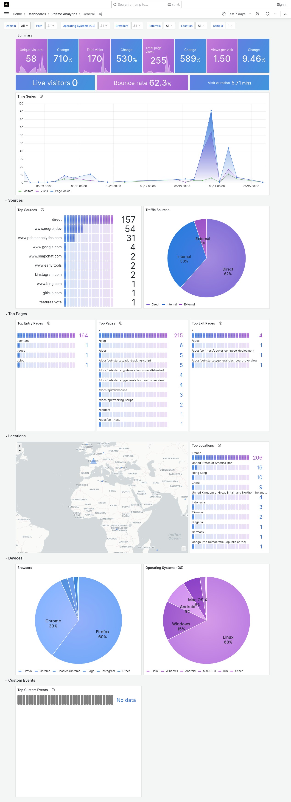

## Parameters

Parameters section influences how your analytics data are retrieved and displayed.

It enables you to filter traffic data and visualize only what you want/need. Here
is a screenshot of 7 parameters of general dashboard:

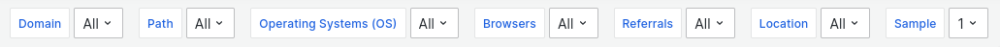

### Date Time Range

First parameter is date time range. It is built-in into [Grafana](https://grafana.com/grafana),
the software we're using to display our dashboard.

This parameter allows you to select the period you want to display (e.g. last
6 months, last 2 hours, etc). You can also select arbitrary date.

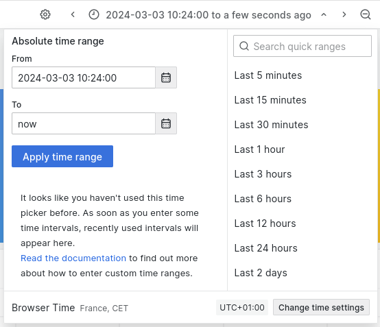

### Domain

Next parameter is the domains. Prisme takes a different approach than other analytics
services and let you visualize all of you websites data on a single dashboard.
This parameter let you filter which domains you want to see.
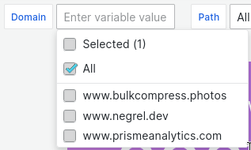

### Path

Path parameter filters pages path.

### Operating Systems (OS)

Operating Systems filter on visitors operating systems family.

### Browsers

Browsers filters on visitors browsers family.

### Referrals

Referrals filters on referral sources.

### Locations

Referrals filters on visitors locations (country).

## Overview section

First section is made of 3 panels with common metrics you would expect on any
web analytics dashboard. It is designed to provide a quick overview of you
website traffic.

### Summary panel

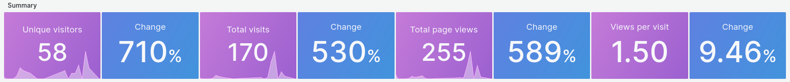

Summary panel is made of metrics and change block.
Metrics meaning are detailed on another page:
* [Unique visitors](./analytics-metrics.md#unique-visitors)
* [Total sessions](./analytics-metrics.md#total-sessions-or-visits)
* [Total page views](./analytics-metrics.md#total-page-views)
* [Views per session](./analytics-metrics.md#views-per-session)

The `Change` values represent the percentage change from one time period to
another within the metric. For instance, if your dashboard displays data for the
last 7 days, the `Change` value for unique visitors would indicate the
percentage difference between the current 7-day period (green rectangle) and the
previous 7-day period (blue rectangle).

### Summary panel 2

Second summary panel shows more advanced metrics.
Metrics meaning are detailed on another page:
* [Live visitors](./analytics-metrics.md#live-visitors)
* [Bounce rate](./analytics-metrics.md#bounce-rate)
* [Session duration](./analytics-metrics.md#session-duration)

### Time series

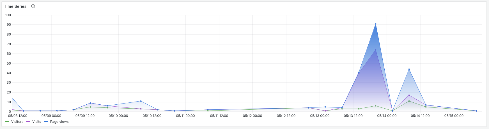

Time serie panel shows you **visitors**, **visits** and **pageviews** over the
[selected period of time](#date-time-range).

## Sources section

Second section is made of two panels showing where your traffic is coming from.

### Top sources

First panel is a bar gauge showing 10 most used sources.

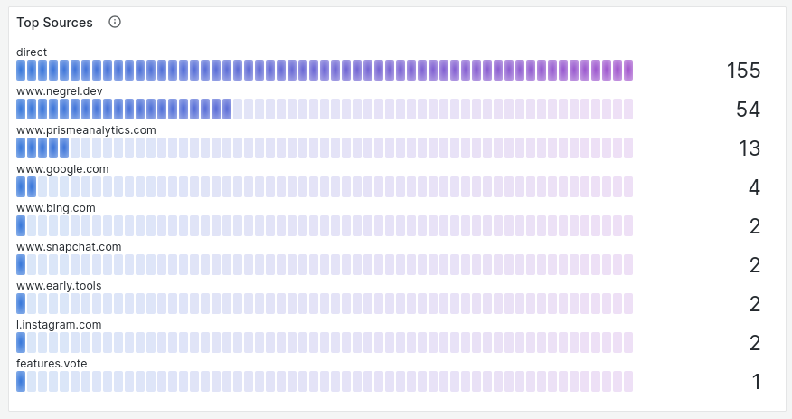

### Traffic sources

Second panel is pie chart showing proportion of **internal traffic**
(e.g. traffic from the same website) vs **direct traffic** vs **external traffic**
(e.g. visitors coming from another website)

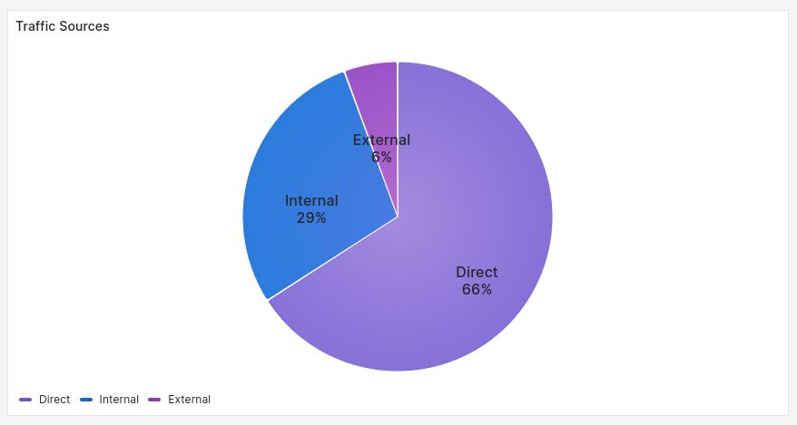

## Top pages

This section shows most popular pages of you websites.

### Entry pages

This bar gauge panels show the 10 most popular [entry pages](./analytics-metrics.md#entry-pages).

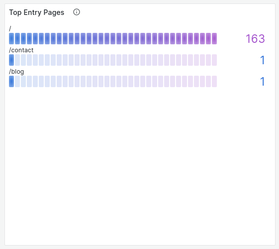

### Top pages

This bar gauge panels show the 10 most popular pages.

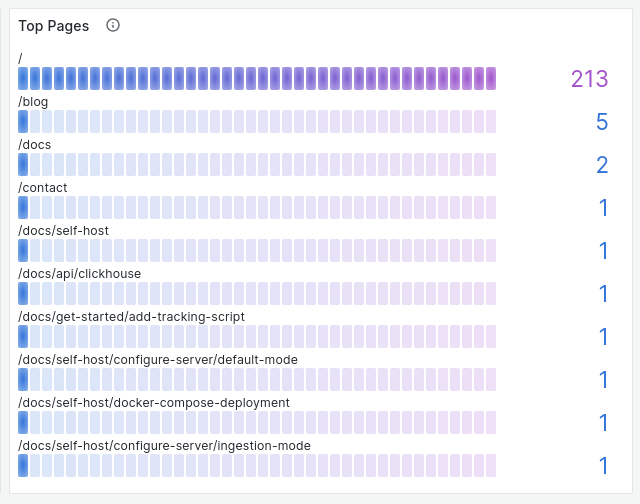

### Exit pages

This bar gauge panels show the 10 most popular [exit pages](./analytics-metrics.md#exit-pages).

## Location section

Location section shows visitors location.

### Map

This map contains markers whose size correspond to eht number of page views per country

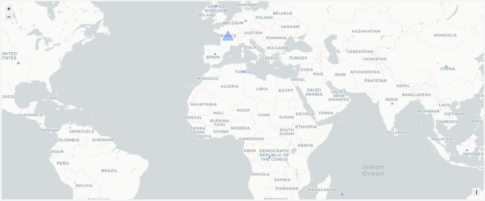

### Top locations

This bar gauge panels show the 10 most popular visitors' location.

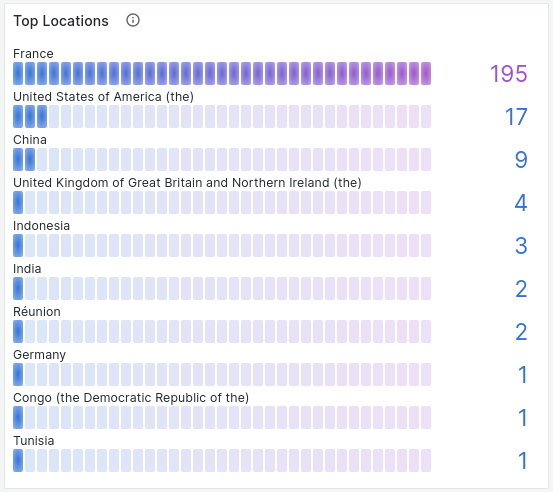

## Devices section

Last section is about visitors' devices.

### Browsers

This pie chart shows visitors' browser family proportion.

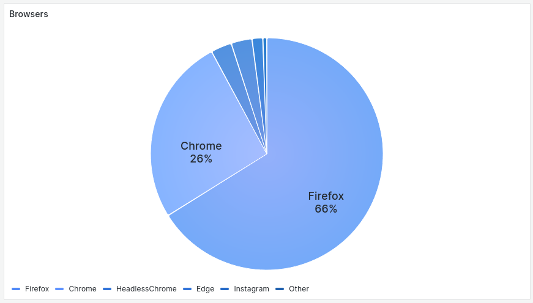

### Operating System (OS)

Second pie chart shows visitors' operating systems family proportion.

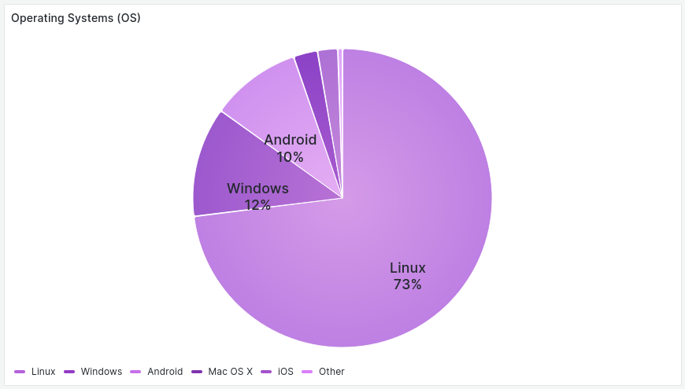

