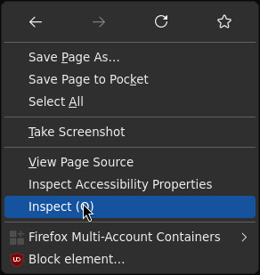
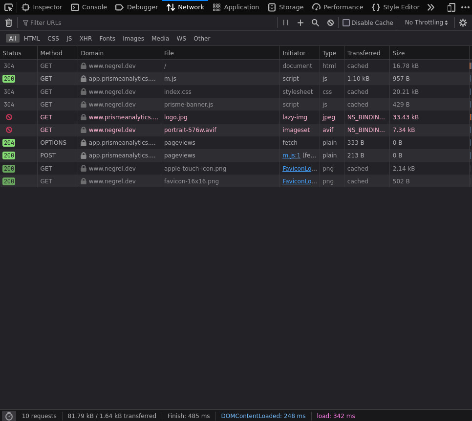

# How to Setup Tracking Script

This guides shows you how to add Prisme Analytics tracking script to your
website.

Our tracking script is ultra light (< 1kB) and designed to not slow down your website.
You can consult its content [here](https://github.com/prismelabs/analytics/blob/master/tracker).

## Prerequisites

* You have a [running Prisme Analytics instance](./self-host-prisme-docker.md).

## Step 1: Add script tag

In order to track pageviews and other metrics, you must add Prisme tracking script on
**all pages** you want to have metrics on.

Regardless of the technology used, the site must contain the following tag:

```html
<script src="https://<your-prisme-instance-hostname>/static/wa.js" defer></script>
```

Depending on the tools you're using to build your website this can be as simple
as editing a single file.

:::note
Tracking script can be configured, see options [here](../reference/tracking-script.md).
:::

## Step 2: Add noscript tag (optional)

If you website can works without javascript and you wants to track visitors with
javascript disabled, you can add the following snippet:

```html
<noscript>
    
</noscript>
```

For all `/api/v1/noscript/events/*` handlers, Prisme returns a small (35 bytes)
single transparent pixel GIF image.

You can read more about noscript events [here](../reference/http.md#noscript-events-api).

## Step 3: Test

Once you've added the script tag, check that tracking works by visiting a page
containing it.

Open your browser, navigate to the page and open developer tools (press right click and then inspect).



Then go to the network tab:



And search for requests to `https://<your-prisme-instance-hostname>/api/v1/events/pageviews`.
You should see a `POST` request with a `200 OK` response.
On the above screenshot, Prisme instance hostname is `app.prismeanalytics.com`.

If you received a non 200 response, it means an error occurred. In that case, checkout
relevant [troubleshoot](#troubleshoot) section.

## Troubleshoot

### 400 Bad Request

If you received a `400 Bad Request`, it means that your Prisme instance rejected
the request because it came from an unautorized
[origin](https://developer.mozilla.org/en-US/docs/Web/HTTP/Headers/Origin).

This can be fixed by adding your website domain to [Prisme origins registry](../reference/server/default-mode.md#origin-registry-options).

### Other

For any other errors, check Prisme logs using `docker logs <prisme-container-name>`.
