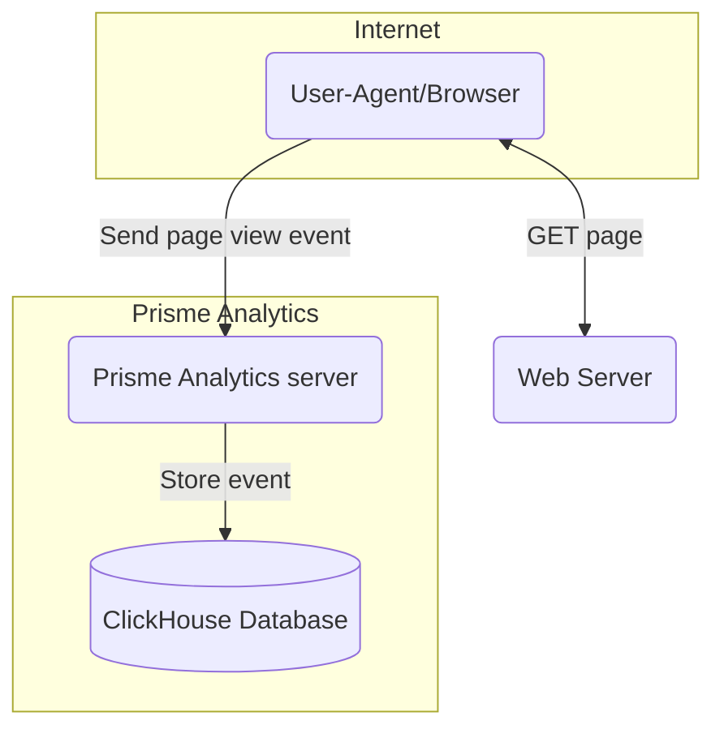

# Ingestion mode

Ingestion mode is a light Prisme Analytics mode for handling and ingesting
events.

It integrates solely with [ClickHouse](https://clickhouse.com).

## Overview

## Configuration options

Configuration of your instance is done by setting `PRISME_<option name>`
environment variable.

### Web server

Prisme has 2 logs, an access logs for processed requests and a general logs for
everything else.

All logs are structured JSON that follows
[`bunyan`](https://github.com/trentm/node-bunyan) format.

You can pipe logs to `bunyan` CLI to pretty print them.

#### Access log

Path to access log file.

Default: `PRISME_ACCESS_LOG=/dev/stdout`

#### Port

Web server listening TCP port.

Default: `PRISME_PORT=80`

#### API endpoints timeout

Duration before handlers timeout on `/api/*` endpoints.

Default: `PRISME_API_EVENTS_TIMEOUT=3s`

### Administration server

Since [v0.15.0](https://github.com/prismelabs/analytics/releases/tag/v0.15.0),
Prisme is able to collect and expose it's metrics on the newly added
administration interface.

#### Host port

`<host>:<port>` string on which administration server will listen.

Default: `PRISME_ADMIN_HOSTPORT=127.0.0.1:9090`
(`PRISME_ADMIN_HOSTPORT="0.0.0.0:9090"` in Docker)

### Proxy options

Prisme Analytics can be positioned behind a reverse proxy, and this section
provides information on options related to the proxy setup. It's important to
note that a misconfigured server can have security implications. Hence, Prisme
Analytics prioritizes **security by default** with carefully chosen default
values.

#### Trust proxy

Whether X-Forwarded-For, X-Request-Id and other proxy related headers should be
trusted. Sets this value to true only if your instance is running behind a
proxy.

Default: `PRISME_TRUST_PROXY=false`

#### Proxy header

HTTP header used to determine client IP address when Prisme Analytics is placed
behind a trusted proxy.

Default: `PRISME_PROXY_HEADER=X-Forwarded-For`

### ClickHouse options

#### Secure connection

Use a TLS connection for ClickHouse.

Default: `PRISME_CLICKHOUSE_TLS=false`

#### Host and port

`<host>:<port>` string pointing to a ClickHouse instance.

Example: `PRISME_CLICKHOUSE_HOSTPORT=clickhouse.localhost:9000`\
This options is **mandatory**.

#### Database

ClickHouse database to use.

Default: `PRISME_CLICKHOUSE_DATABASE=prisme`

### Origin registry options

#### Origins

Comma separated list (without whitespace) of valid
[origins](https://developer.mozilla.org/en-US/docs/Web/HTTP/Headers/Origin).
Events coming from an invalid source are rejected.

Example: `PRISME_SOURCE_REGISTRY_SOURCE=www.example.com,app.example.com`

### Event store options

Event store is responsible of storing events efficiently in ClickHouse.

ClickHouse recommend keeping number of insertions to 1 per seconds max and
inserting rows per batch of tens of thousands.

#### Maximum batch size

Maximum size of an events batch before it is sent to ClickHouse. Leave as
default unless you have high traffic load.

Default: `PRISME_EVENTSTORE_MAX_BATCH_SIZE=4096`

#### Maximum batch timeout

Maximum duration before current batch is sent to event store.

Default: `PRISME_EVENTSTORE_MAX_BATCH_TIMEOUT=1m`
