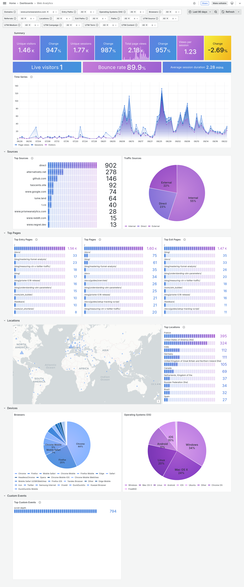
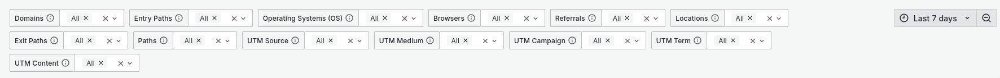
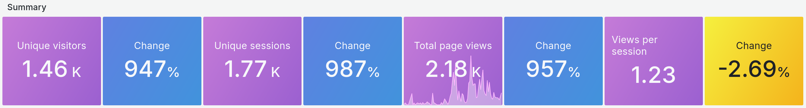
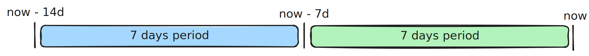
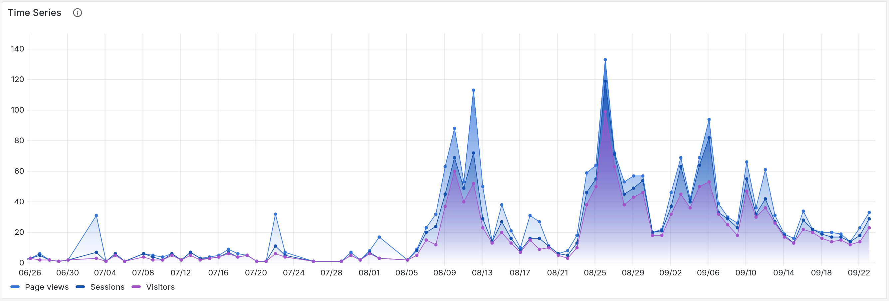
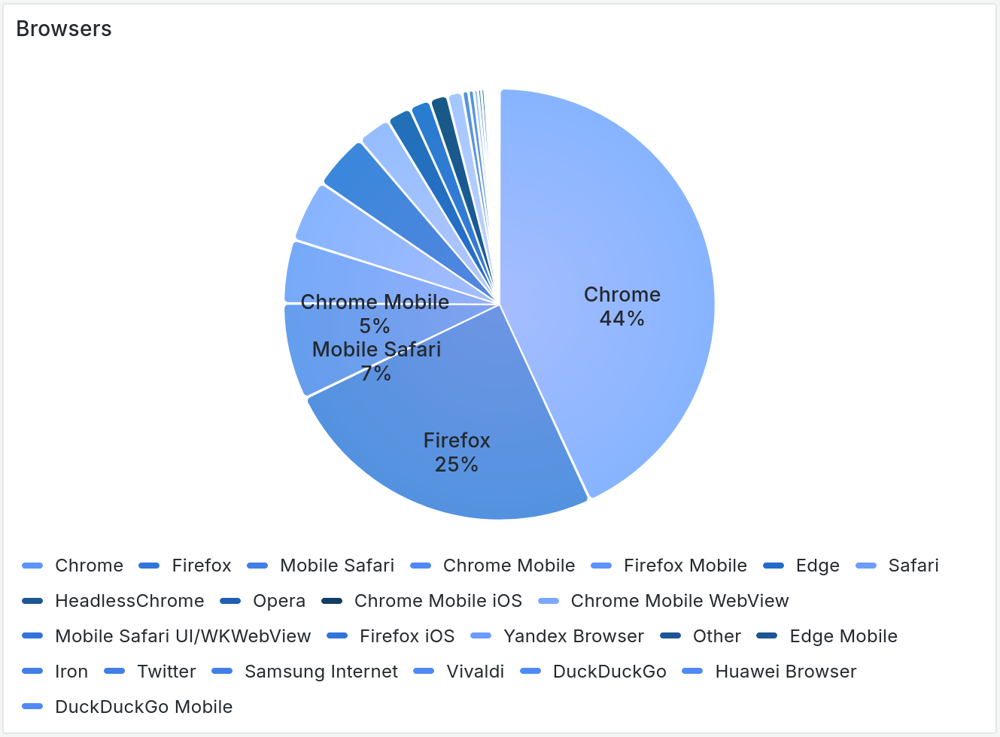
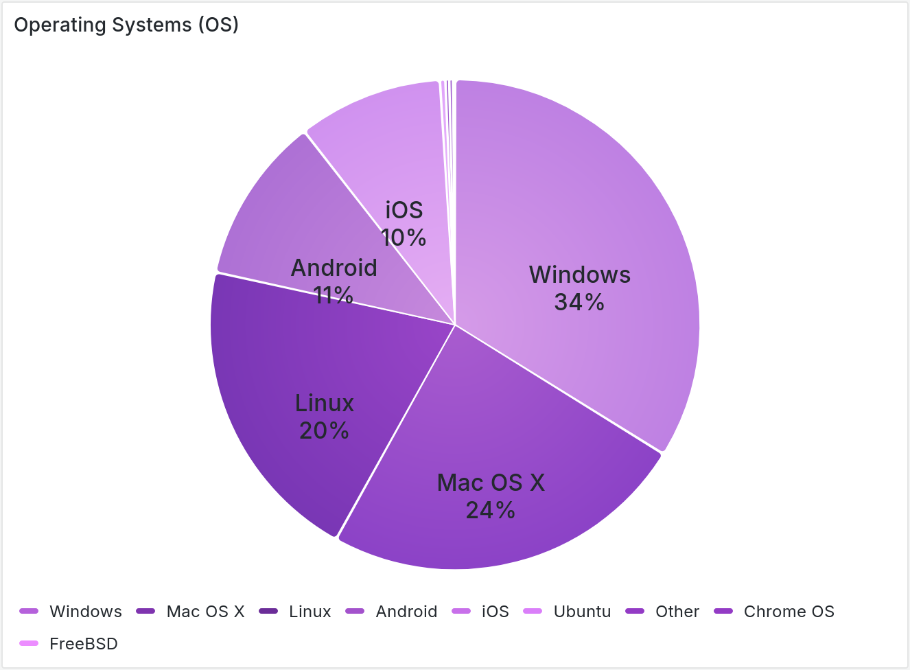

import TopSources from "./images/general-dashboard/top-sources.png"
import TrafficSources from "./images/general-dashboard/traffic-sources.png"
import TopEntryPages from "./images/general-dashboard/top-entry-pages.png"
import TopPages from "./images/general-dashboard/top-pages.png"
import TopExitPages from "./images/general-dashboard/top-exit-pages.png"
import TopLocations from "./images/general-dashboard/top-locations.png"
import TopCustomEvents from "./images/general-dashboard/top-custom-events.png"

# Web analytics dashboard

Prisme Analytics comes with a built-in web analytics dashboard, that focus on
measuring and analyzing anonymous traffic in order to understand how to maximize
conversion.

This document introduces and explains every panel of this dashboard:

## Parameters

Parameters section influences how your analytics data are retrieved and
displayed.

It enables you to filter traffic data and visualize only what you want/need.
Here is a screenshot of 14 parameters of general dashboard:

- **Date time range**: The specific time period we want to visualize
- **Domains**: Website domain names
- **Entry Paths**: Paths of first pages viewed by a visitor within a session
- **Operating Systems**: Visitors' Operating System family
- **Browsers**: Visitors' browser family
- **Referrals**: Domain from which page was visited or `direct`
- **Locations**: Visitors' country
- **Exit Paths**: Paths of last pages viewed by a visitor within a session
- **Paths**: Paths of visited pages.
- **UTM parameters (source, medium, campaign, term, content)**: Session started
  with the given
  [UTM parameters](https://www.prismeanalytics.com/blog/understanding-utm-parameters/)

## Overview section

First section is made of 3 panels with common metrics you would expect on any
web analytics dashboard. It is designed to provide a quick overview of you
website traffic.

### Summary panel

Summary panel is made of metrics and `Change` block.

- **Unique visitors**: Number of [people who visited](./glossary.md#visitor)
  your website
- **Unique sessions**: Number of
  [sessions (or visits)](./glossary.md#session-or-visit)
- **Total [page views](./glossary.md#page-view)**: Total number of times your
  pages were loaded by your visitors
- **Views per session**: Average number of [page view](./glossary.md#page-view)
  per [session](./glossary.md#session-or-visit)

The `Change` values represent the percentage change from one time period to
another within the metric. For instance, if your dashboard displays data for the
last 7 days, the `Change` value for unique visitors would indicate the
percentage difference between the current 7-day period (green rectangle) and the
previous 7-day period (blue rectangle).

### Summary panel 2

Second summary panel shows more advanced metrics.

- **Live visitors**: Number of visitors currently active on your website
- **Bounce rate**: Rate of sessions that [bounce](./glossary.md#bounce)
- **Average session duration**: Average
  [session](./glossary.md#session-or-visit) duration

### Time series

Time serie panel shows you **[visitors](./glossary.md#visitor)**,
**[sessions](./glossary.md#session-or-visit)** and
**[page views](./glossary.md#page-view)** over the
[selected period of time](#date-time-range).

## Sources section

Second section is made of two panels showing where your traffic is coming from.

### Top sources

First panel is a bar gauge showing 10 most used sources.

### Traffic sources

Second panel is pie chart showing proportion of **internal traffic** (e.g.
traffic from the same website) vs **direct traffic** vs **external traffic**
(e.g. visitors coming from another website)

## Top pages

This section shows most popular pages of you websites.

### Entry pages

This bar gauge panels show the 10 most popular
[entry pages](./glossary.md#entry-page).

### Top pages

This bar gauge panels show the 10 most popular pages.

### Exit pages

This bar gauge panels show the 10 most popular
[exit pages](./glossary.md#exit-page).

## Location section

Location section shows visitors location.

### Map

This map contains markers whose size is relative to the number of page views per
country.

### Top locations

This bar gauge panels shows the 10 most popular visitors' location.

## Devices section

Last section is about visitors' devices.

### Browsers

This pie chart shows visitors' browser family proportion.

### Operating System (OS)

Second pie chart shows visitors' operating systems family proportion.

## Custom events section

Custom events section shows your custom events.

### Top custom events

This bar gauge panels shows the 10 most received custom events.

