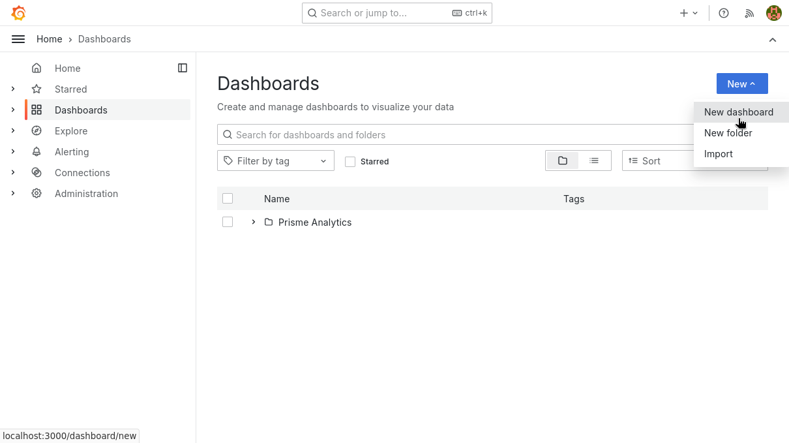
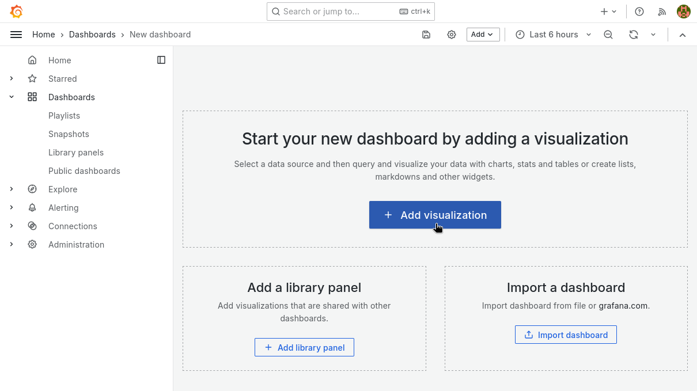
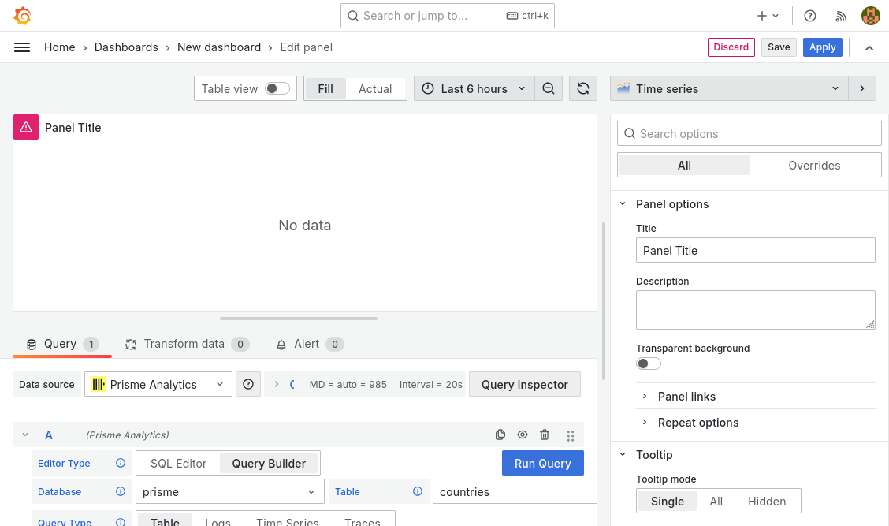
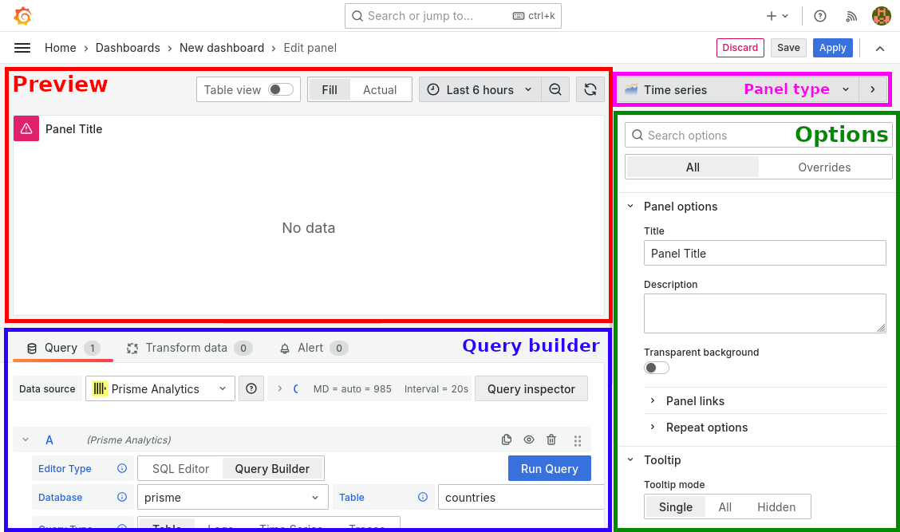
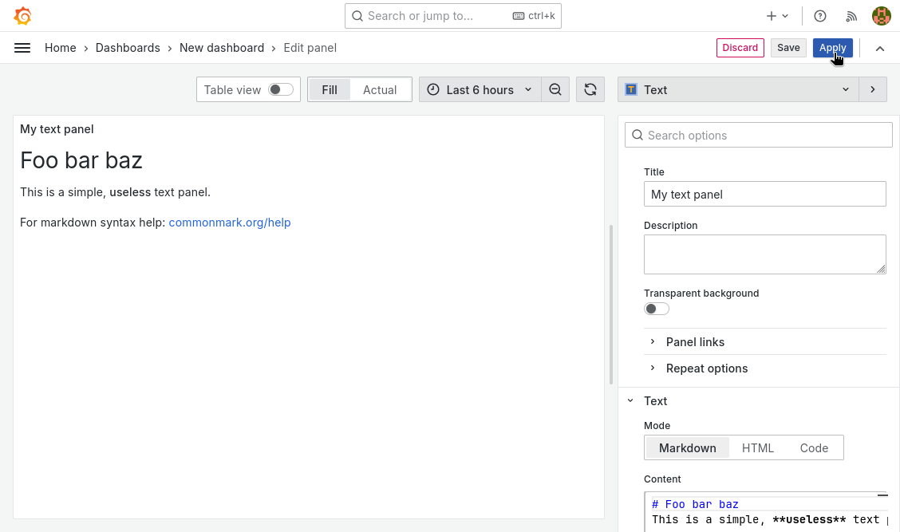
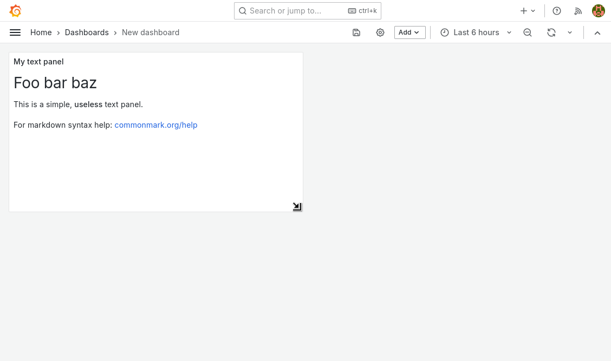
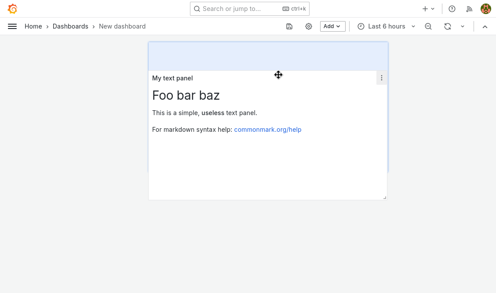
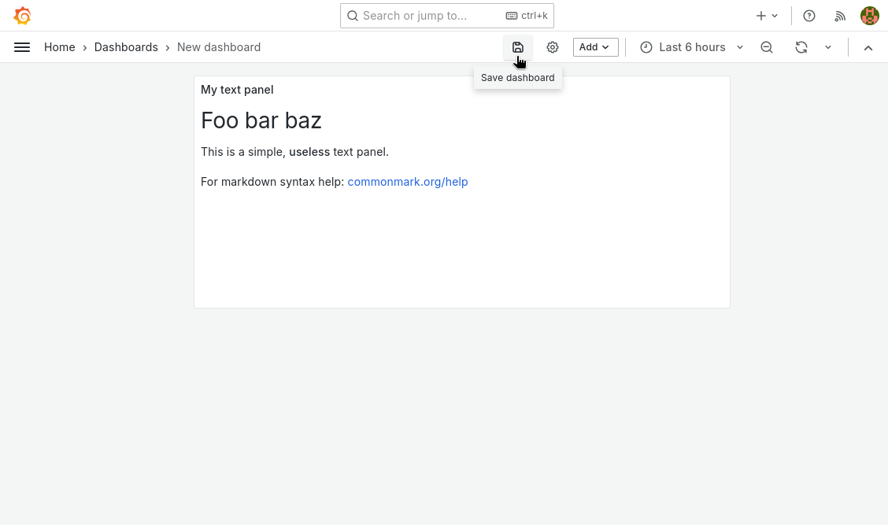
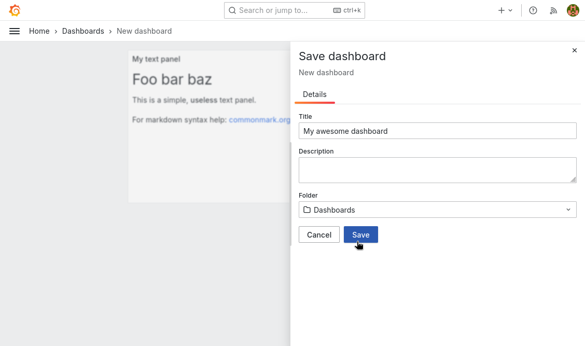
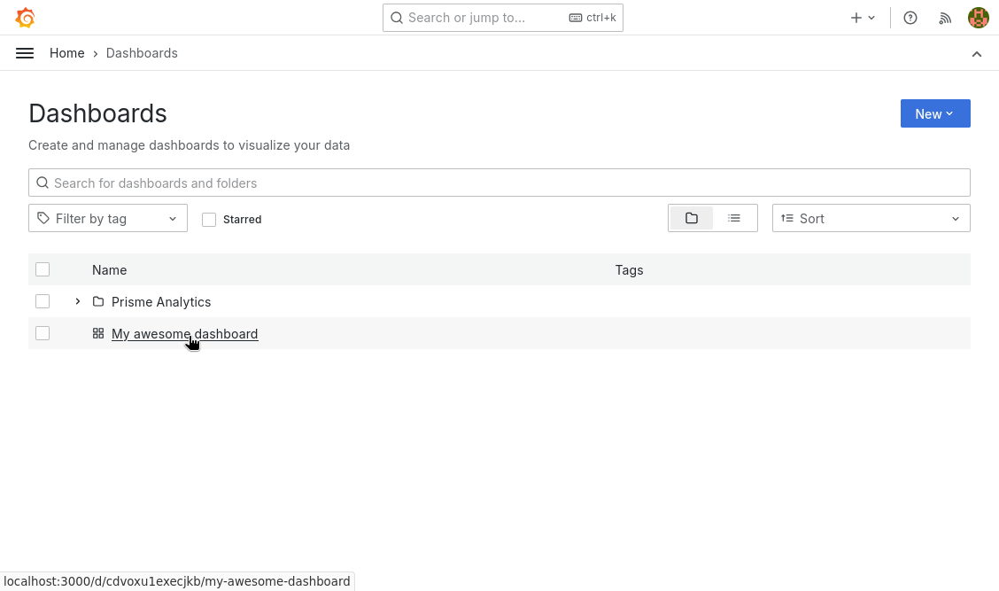

import SelectPanelType from "./images/select_panel_type.png"

# How to create a custom dashboard

Custom dashboards enable you to create a tailored view of your data,
highlighting the metrics and KPIs that matter most to your organization. This
guides shows you how to create a custom dashboard in Prisme Analytics.

## Step 1: Create an empty dashboard

On the side bar, click on the `dashboard` entry, you should see the following
page:

Then, click on the `New` dropdown button and then select the `New dashboard`
entry. This create an empty dashboard:

## Step 2: Add panels / visualization

Dashboards are useless if they're empty, we must add some content to it. Click
`+ Add visualization` button to navigate to edit panel page.

This is page is made of 4 parts:

- Preview: view of panel in real time as you edit options
- Query builder: Graphical builder for easily querying data from the
  [ClickHouse](https://clickhouse.com) database
- Panel type: Dropdown menu with dozens of panels type
- Panel options: Standard and specific panel options

For this guide, we add a simple text panel that don't query any analytics data
for sake of simplicity. Checkout
[How to track scroll depth](./track-scroll-depth.md#step-6-create-a-new-panel)
guide to see a more realistic example.

Set panel type to Text.

Then explore and edit options until you're satisfied of the result:

Once you're satisfied, click on the blue apply button.

## Step 3: Resize and move panel

Once your panels are ready, you can resize and move them:

Finally, when your dashboard is ready, it is time to save it.

## Step 4: Save dashboard

Click on the save icon in the top bar.

Then sets dashboard name, description, destination folder and click save.

:::note

Don't save dashboards in `Prisme Analytics` folder as it is reserved for
built-ins dashboards.

:::

Finally, your dashboard is now visible on dashboards page:

That's it, you've successfully created a custom dashboard!
